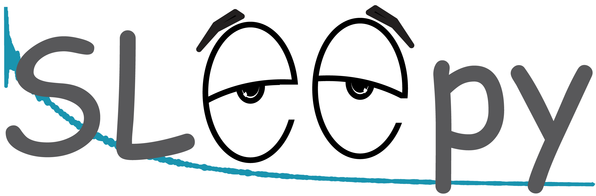

# SLEEPY
Spins in Liouville space for rElaxation and Exchange in PYthon

Currently under development. Requires standard python packages plus numpy/scipy/matplotlib.

Under development should be taken seriously. Please contact me if you want to publish something using SLEEPY sims, so I can at least check that everything is valid for the simulations.

While the number of known issues has been greatly reduced, testing is still underway. It may be a good idea to contact us and ask if your specific simulation should run correctly. Most simulations, however, should work at this point.

Copyright 2024 Albert Smith-Penzel

All files are copyrighted under the GNU General Public License. A copy of the license has been provided in the file LICENSE

Funding for this project provided by:

Deutsche Forschungsgemeinschaft (DFG) grant 450148812
